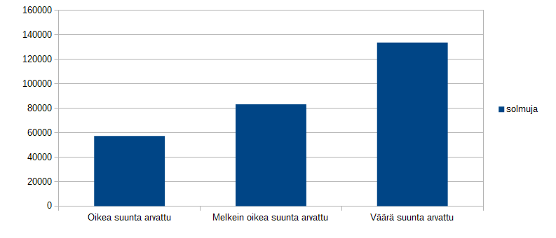

## Toteutus

Ohjelmassa on pääpiirteiltään kaksi osaa. Ensimmäinen osa on tarvittavat kirjastot millä voi simuloida pelin etenemistä. Kirjastolla pystyy siirtämään pelaajan, josta palautuksena saa kopion pelikentästä siirron jälkeisellä tilanteella. Kirjastossa on pyritty kopioimaan niin vähän kun mahdollista. Käytännössä kopioidaan pelaajat, ja kultakaivokset. Aikavaativuus on siis O(H+G), missä H on pelaajat, ja G on kultakaivokset.

Toinen osa on itse alpha-beta algoritmiin perustuva botti. Botilla on pelisääntöjen mukaan sekunti aikaa päättää, minkä siirron se tekee pelissä. Botti toimii branch-and-bound perjaatteella. Se etenee siirto kerrallaan alas pelipuuta. Algoritmi palaa ylös jos pääsee pelin loppuun, maksimisyvyyteen, tai alpha-betan mukaiseen tilanteeseen jossa todetaan, että tilannetta ei tarvitse simuloida syvemmälle. Alpha-beta algoritmin aikavaativuus pahimmassa tapauksessa on O(S^D), S on siirtojen lukumäärä ja D on syvyys pelipuussa. Käytännössä se pitäisi toimia jonkin verran nopeammin, koska karsitaan pois turhia alipuita. Tilavaativuus tulee enimmäkseen siitä, että jokaisesta pelitilanteen muutoksesta luodaan kopio, jotta voidaan helposti siirtyä takaisin edelliseen tilanteeseen. Tämän johdosta muistissa on enimmäkseen pelin loppuun asti, eli puun yksi kokonainen haara kerrallan, eli O(D).

Käytössä olevat itsetoteutetut aputietorakenteet ovat ArrayList, Queue ja InsertionSort. Lisäksi botti käyttää leveyssuntaista hakua kiinnostavien kohteiden etäisyyden mittaamiseen.

Bottia pyritään optimoimaan muutamalla eri tavalla. Ensinnäkin alpha-beta karsiminen karsii pois tarkistettavia solmuja, jos parempi vaihtoehto on jo löydetty. Jotta alpha-beta toimisi paremmin, pyritään myös arvaamaan parhaan siirron. Paras siirto arvataan olevan se, joka johtaa pelaajan ei-hallitsemaan kultakaivokseen. Jos botilla on liian vähän life-pisteitä valtaakseen kultakaivoksen, arvataan sen sijaan, että paras siirto on kohti tavernaa. Mahdollisia siirtoja karsitaan myös sen perusteella, että ei edetä pelipuussa alas siirtoja jotka ovat sama kun, että pysyttäisiin paikoillaan.

Yhden peli-vuoron aikavaativuus koostuu pelikentän parsimisesta (R), reitinhausta (P) ja alpha-beta algoritmin suorituksesta (S^D). Alpha-beta algoritmin suorituksen aikavaativuus koostu siirtojen generoinnista (ml. niiden järjestäminen) (S^2) ja pelikentän mutatoinnista. Pelikentän mutatoinnin aikavaativuus sen sijaan koostuu pelaajien kopioinnista (H) ja kultakaivosten kopioinnista (G). Botin kokonaisaikavaativuus voisi siis sanoa olevan O(R + P + S^D*S^2*(H+G)) = O(R + P + S^(D+2)*(H+G)) = O(S^(D+2)*(H+G)).

Vaikka pelaajia ja kultakaivoksia on suhteellisen vähän, tulee niiden kopioinnista kuitenkin aika iso lisä aikavaativuuteen kun se tehdään jokaiseen mutaatioon. Kopioinnin sijaan bottia voisi vielä parantaa tekemällä jonkin näköiset mutaattorit, jotka osaisivat muutta pelitilanteen sekä eteenpäin, että taaksepäin. Näitä suoritettaisiin sitten, ennen ja jälkeen siirtojen tekemistä. Näin päästäisiin pois kopioinnin tuottamasta aika-lisästä. Myös muitakin alpha-beta algoritmin parannuksia (ks. chessprogramming lähde) voisi implementoida jotta päästäisiin sekunnissa syvemmälle pelipuussa.

Algoritmin toimintaa kuvaa seuraava taulukko, josta näkyy, miten monta solmua on jouduttu tarkistamaan, riippuen miten hyvin ollaan arvattu oikea siirto.

Lähteet:
- https://chessprogramming.wikispaces.com/Alpha-Beta
- TIRA-kurssin materiaali